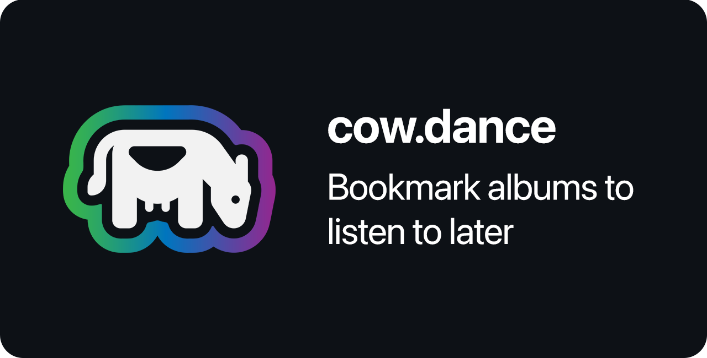

# cow.dance

A SwiftUI app for bookmarking albums you want to listen to later. Simply paste a Spotify link or share directly from the Spotify app to quickly add it to your list.

## Demo

[](./Demo/demo.mp4)


## Development

To get started, clone the repository and open the project in Xcode. You will need to create a Spotify Developer account and create a new app to get your client ID and client secret. Create `Shared/Config.xcconfig` and add the following:

```
SPOTIFY_CLIENT_ID = YOUR_CLIENT_ID
SPOTIFY_CLIENT_SECRET = YOUR_CLIENT_SECRET
```

## License

[MIT license](./LICENSE)